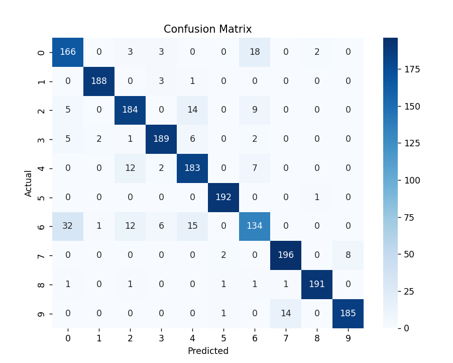

# 👕 Fashion MNIST Classification using PyTorch CNN

This project implements a **Deep Learning model using PyTorch** to classify images from the **Fashion MNIST dataset**.

The goal of this project is to build a **multi-class image classification model** that can recognize different types of clothing items such as T-shirts, trousers, shoes, and bags.

This project demonstrates how **Convolutional Neural Networks (CNNs)** can be used for image classification tasks using PyTorch.

---

## 📊 Dataset

The dataset used in this project is the **Fashion MNIST Dataset**.

It consists of grayscale images of clothing items, commonly used as a benchmark dataset for computer vision tasks.

Dataset details:

- **60,000 training images**
- **10,000 test images**
- **10 classes**
- Image size: **28×28 pixels (grayscale)**

---

## 🧾 Classes

The dataset includes the following classes:

| Label | Class |
|------|------|
| 0 | T-shirt/top |
| 1 | Trouser |
| 2 | Pullover |
| 3 | Dress |
| 4 | Coat |
| 5 | Sandal |
| 6 | Shirt |
| 7 | Sneaker |
| 8 | Bag |
| 9 | Ankle boot |

---

## ⚙️ Project Workflow

The project follows a typical **Deep Learning pipeline**:

1. Load dataset from CSV file  
2. Perform **data normalization**  
3. Split dataset into **training and testing sets**  
4. Create a **custom PyTorch Dataset class**  
5. Use **DataLoader for batching**  
6. Build a **CNN model**  
7. Train the model using **CrossEntropyLoss**  
8. Optimize using the **Adam optimizer**  
9. Apply **learning rate scheduling**  
10. Evaluate performance using **accuracy and confusion matrix**  

---

## 🧠 Model Architecture

The CNN model consists of:

### Convolutional Layers
- 2 convolutional blocks  
- Batch Normalization  
- ReLU activation  
- MaxPooling  

### Fully Connected Layers
- Dense layer with 128 neurons  
- Dropout (0.6) for regularization  
- Output layer with 10 classes  

---

## 🏋️ Training Configuration

| Parameter | Value |
|------|------|
| Loss Function | CrossEntropyLoss |
| Optimizer | Adam |
| Learning Rate | 0.001 |
| Scheduler | StepLR |
| Epochs | 18 |
| Batch Size | 32 |

---

## 📈 Results

| Metric | Value |
|------|------|
| Training Accuracy | **~93%** |
| Testing Accuracy | **~90%** |

The model performs well on most classes but struggles with visually similar clothing items such as:

- Shirt vs T-shirt  
- Pullover vs Coat  

---

## 🛠 Technologies Used

- Python  
- PyTorch  
- NumPy  
- Pandas  
- Matplotlib  
- Seaborn  
- Scikit-learn  

---

## 📁 Project Structure
```
fashion-mnist-cnn-pytorch/
│
├── train.py
├── model.py
├── dataset.py
├── utils.py
├── requirements.txt
└── README.md
```
---

## 🚀 How to Run
### 1️⃣ Clone the Repository

```bash
git clone https://github.com/shakila-alam-aishy/fashion-mnist-cnn-pytorch.git
cd fashion-mnist-cnn-pytorch
```

### 2️⃣ Install Dependencies

```bash
pip install -r requirements.txt
```

### 3️⃣ Run the Model

```bash
python train.py
```
---

## 📊 Output

- Training Loss Graph  
- Accuracy Graph  
- Confusion Matrix  



---

## 🔮 Future Improvements

- Data Augmentation  
- Deeper CNN architecture  
- Hyperparameter tuning  
- Transfer learning (ResNet, EfficientNet)  
- Deployment using Flask / FastAPI  
- Web-based interface for image classification  

---

## 👩‍💻 Author

**Shakila Alam Aishy**

Machine Learning & Deep Learning Enthusiast 🚀  

---

## ⭐ Support

If you like this project, please consider **starring the repository** ⭐
